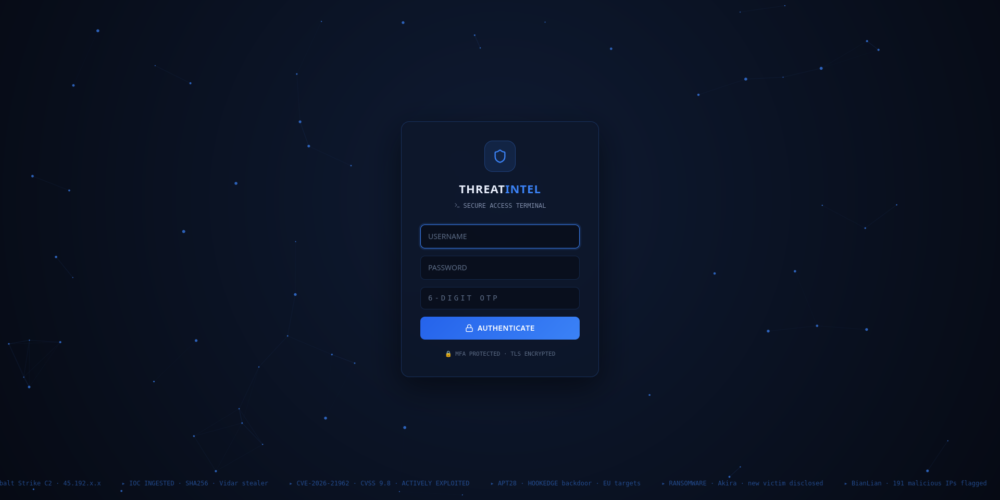
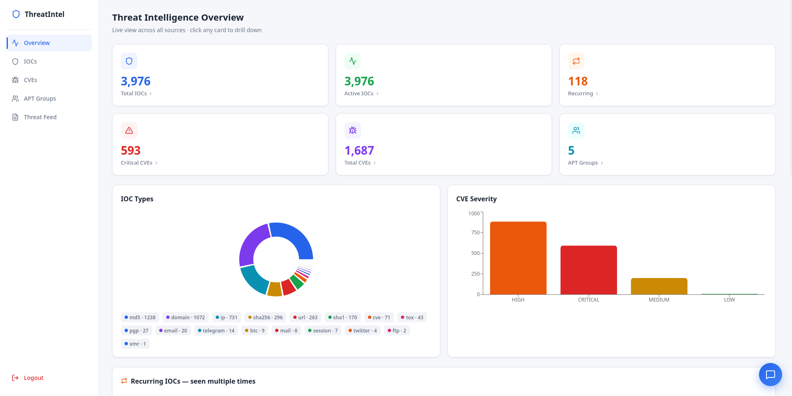
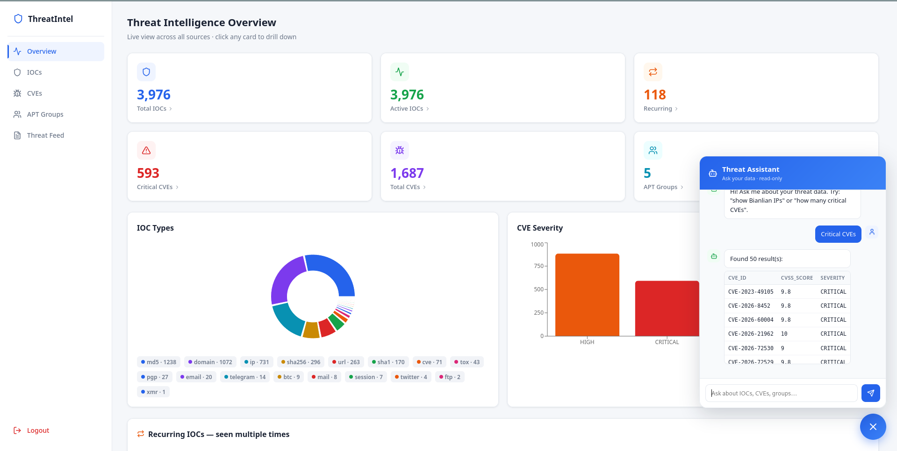
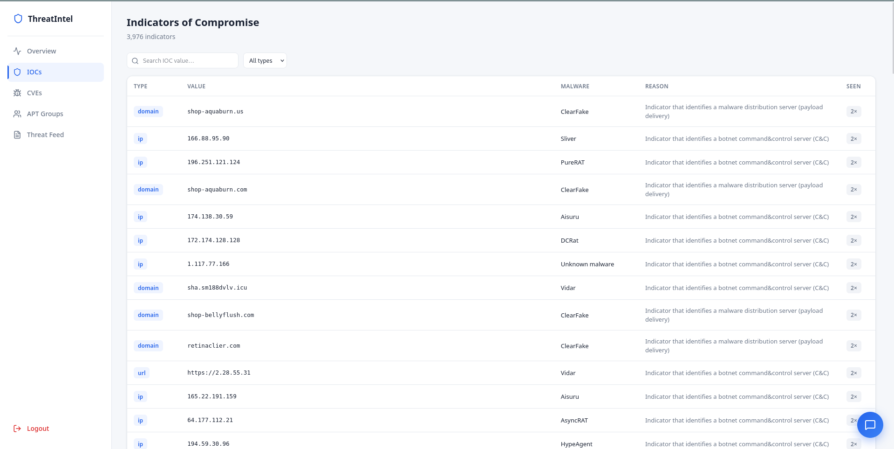
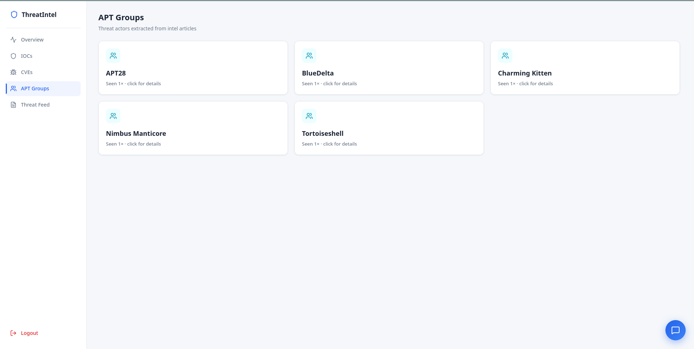
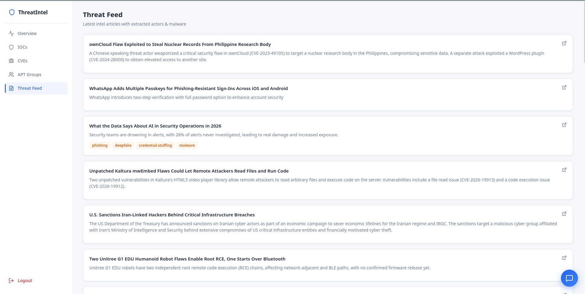

# 🛡️ Custom Threat Intelligence Platform

> A self-hosted, AI-powered Cyber Threat Intelligence (CTI) platform that aggregates indicators from multiple public sources, deduplicates and enriches them, and surfaces them through a secure, interactive dashboard with a natural-language query assistant.


---

## 📖 Overview

This platform automates the full CTI lifecycle: **collect → normalize → enrich → serve**. It pulls threat data from five public feeds, resolves it into a clean, deduplicated database with a **sighting-tracking model** (so a recurring indicator is recorded, not duplicated), enriches unstructured articles using a **local LLM**, and presents everything through an authenticated HTTPS dashboard — including an **"ask your data" chatbot** that converts plain-English questions into safe SQL.

Built end-to-end as a hands-on SOC/DevSecOps project: data engineering, backend APIs, frontend, automation, and production-grade security hardening.

---


## 📸 Screenshots

### Secure Login (MFA + TLS)


### Threat Intelligence Dashboard


### AI Chatbot — Ask Your Data


### IOC Explorer


### APT Groups


### Threat Feed


## ✨ Key Features

| Feature | Description |
|---------|-------------|
| **Multi-source ingestion** | ransomware.live, abuse.ch ThreatFox, CISA KEV, NVD, The Hacker News |
| **Deduplication + Sightings** | Canonical normalization (defang, lowercase, port-strip) + recurring-indicator tracking |
| **LLM enrichment** | Local Ollama (llama3.2) extracts APT groups, malware, and per-IOC reasoning from articles |
| **CVE intelligence** | CVSS scores + severity (NVD) combined with actively-exploited flags (CISA KEV) |
| **Interactive dashboard** | React SPA with drill-down, charts, detail panels, and click-through filtering |
| **AI chatbot** | Natural-language → SQL over the threat database (read-only, validated) |
| **Automated feeds** | Cron-scheduled pulls with per-run logging |

---

## 🏗️ Architecture

```
                 ┌──────────── SOURCES ────────────┐
                 │ ransomware.live · ThreatFox      │
                 │ CISA KEV · NVD · Hacker News     │
                 └────────────────┬─────────────────┘
                                  │  (cron, daily)
                                  ▼
                        ┌──────────────────┐
                        │   Connectors     │  raw JSONB landing
                        └────────┬─────────┘
                                 ▼
                        ┌──────────────────┐
                        │   Processors     │  normalize · dedup · sightings
                        │  + Ollama (LLM)  │  APT / malware / reasoning
                        └────────┬─────────┘
                                 ▼
                     ┌────────────────────────┐
                     │   PostgreSQL           │  iocs · cves · articles
                     │   (clean, indexed)     │  apt_groups · sightings
                     └───────┬────────────────┘
                             │  (read-only user)
                             ▼
                     ┌────────────────┐        ┌──────────────┐
                     │  FastAPI       │◄───────│  Ollama      │  text-to-SQL
                     │  (auth+MFA)    │        │  (chatbot)   │
                     └───────┬────────┘        └──────────────┘
                             │  HTTPS / JWT
                             ▼
                     ┌────────────────┐
                     │  nginx (TLS)   │  reverse proxy + static
                     └───────┬────────┘
                             ▼
                     ┌────────────────┐
                     │  React SPA     │  dashboard + chatbot
                     └────────────────┘
```

---

## 🔐 Security (DevSecOps)

Security was treated as a first-class concern, not an afterthought:

- **Authentication** — username + bcrypt-hashed password
- **MFA** — TOTP (Google Authenticator / Authy), out-of-band second factor
- **JWT** — signed, expiring session tokens
- **TLS/HTTPS** — all traffic encrypted (nginx reverse proxy)
- **Least privilege** — API uses a dedicated **read-only** database role; connectors use a separate write role
- **Chatbot safety** — SELECT-only validation, forbidden-keyword blocking, single-statement enforcement, query timeout, executed on the read-only role
- **CORS lockdown** — API accepts only the dashboard origin
- **Security headers** — anti-clickjacking, MIME-sniffing protection
- **Secrets hygiene** — no secrets in the repo; `.env` git-ignored, `.env.example` provided

---

## 🧰 Tech Stack

**Backend:** Python, FastAPI, psycopg2, python-jose (JWT), bcrypt, pyotp (MFA)
**Frontend:** React (Vite), Recharts, lucide-react, axios
**Data:** PostgreSQL 16 (+ pgvector-ready), JSONB landing zone
**AI:** Ollama (llama3.2) — local, offline, free
**Infra:** Docker (Postgres/Ollama/n8n), nginx (TLS), systemd, cron

---

## 📊 Data Model Highlights

- **Raw landing zone** (`raw_items`, JSONB) — source of truth, never mutated
- **`iocs`** — deduplicated on `(ioc_type, value)`, with `times_seen`, `first_seen`, `last_seen`, `is_active`
- **`ioc_sightings`** — every observation logged (source + timestamp) for activity tracking
- **`cves`** — CVSS + severity + KEV (actively-exploited) flag
- **`articles` / `apt_groups`** — LLM-extracted intel

The sighting model means the same indicator appearing across sources or days is **recorded as a new sighting, not a duplicate row** — enabling "this old IOC was seen again" detection.

---

## 🚀 Getting Started

> Prerequisites: Docker, Python 3.12, Node.js 20, Ollama with `llama3.2`

```bash
# 1. Backend
cd backend
cp .env.example .env          # fill in your DB + API keys
python -m venv venv && source venv/bin/activate
pip install -r requirements.txt
uvicorn api:app --host 0.0.0.0 --port 8000

# 2. Admin + MFA setup
python setup_admin.py          # sets password, prints MFA QR

# 3. Frontend
cd ../frontend
cp .env.example .env
npm install && npm run build

# 4. Run feed pipeline
./run_pipeline.sh
```

---

## 🗺️ Roadmap

- [x] Multi-source ingestion + dedup + sightings
- [x] LLM enrichment (Ollama)
- [x] Authenticated dashboard (MFA + TLS)
- [x] Natural-language chatbot
- [ ] VirusTotal / AbuseIPDB reputation enrichment
- [ ] MITRE ATT&CK technique mapping
- [ ] STIX/TAXII + firewall blocklist export
- [ ] Time-series threat trends

---

## 📝 Notes

This is a personal learning + portfolio project demonstrating the full CTI engineering lifecycle — from raw feed ingestion to a secured, AI-assisted analyst interface. All data sources are public and used within their terms.

---

*Built by [Aditya Raj](https://github.com/adityrajtiwary) — Aspiring SOC Analyst*
